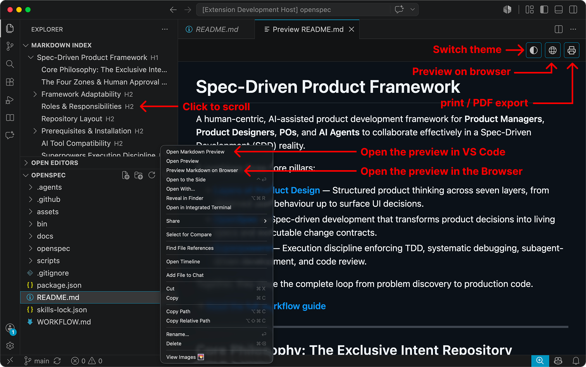
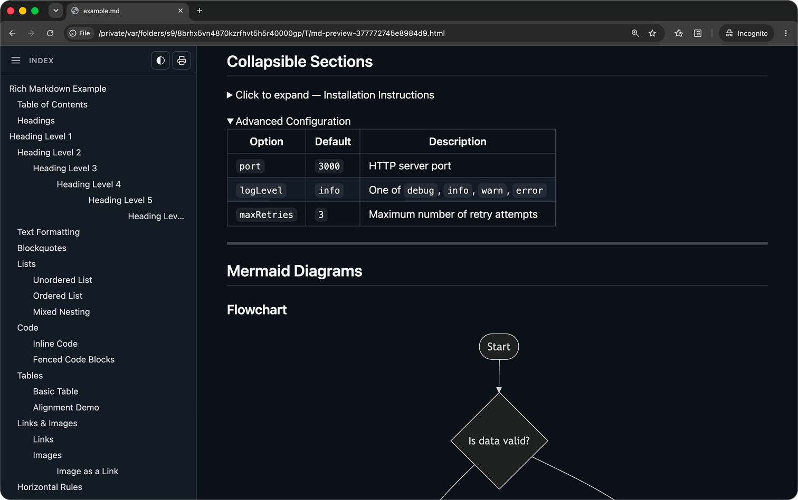

# Markdown Index

A lightweight VS Code extension that displays a **Table of Contents** for the active markdown file, plus a GitHub-styled custom preview with Mermaid diagrams, syntax highlighting, and printing.


*The Markdown Index outline in the Explorer sidebar, the custom preview open side-by-side in VS Code, the editor toolbar buttons for opening the preview, previewing on browser, and printing, plus the right-click context menu shortcuts.*


*The GitHub-styled browser preview, with its own table-of-contents sidebar, theme toggle, print button, and rendered content — including collapsible sections and Mermaid diagrams.*

## Features

### Outline / Table of Contents

- **Hierarchical outline** — Headings (H1–H6) displayed as a nested tree mirroring your document structure.
- **Click to navigate** — Select any heading to jump straight to it in the editor or preview.
- **Live updates** — The tree refreshes automatically as you type.
- **Search headings** — Filter the tree to quickly find a heading in long documents; clear the filter with one click.
- **Collapse/expand all** — Toggle the whole tree open or closed from the view toolbar.
- **Flexible placement** — Show the index in the Explorer panel or as its own sidebar icon.
- **Works beyond `.md`** — Also parses headings in `SKILL.md`, `.prompt.md`, `.instructions.md`, and `.agent.md` files.

### Custom Markdown Preview

- **GitHub-styled rendering** via `github-markdown-css`, with full GitHub Flavored Markdown parity:
  - Mermaid diagrams (` ```mermaid ` fences), rendered client-side and re-themed on light/dark toggle.
  - Syntax-highlighted fenced code blocks (via `highlight.js`, GitHub light/dark themes).
  - GFM task list checkboxes (`- [ ]` / `- [x]`), read-only to match GitHub's file view.
  - Heading anchor links (hover-to-reveal `#` permalink).
  - Footnotes (`[^1]`) and emoji shortcodes (`:smile:`).
  - GFM alert callouts (`> [!NOTE]`, `> [!TIP]`, `> [!IMPORTANT]`, `> [!WARNING]`, `> [!CAUTION]`).
- **Link navigation** — Click internal relative links (e.g. `./WORKFLOW.md`), header anchors (`#heading`), and external URLs directly from the preview.
- **Per-file preview windows** — Each file gets its own preview panel; opening a file that already has one open just reveals it instead of repurposing it.
- **Always-live content** — Preview content stays up to date as you type, even when a different file's preview (or no preview at all) is focused.
- **Double-click to jump** — Double-click a line in the preview to jump to the equivalent line in the source editor.
- **Light/dark theme toggle** — Switch the preview's theme independently of (or matching) your VS Code color theme.
- **Print support** — Print the current file with the preview's styling, layout, and diagrams applied.
- **Browser preview** — Open the rendered markdown in your default web browser.

## Usage

1. Open any `.md` file.
2. Look for **Markdown Index** in the Explorer sidebar or click the book icon in the activity bar.
3. Click a heading to scroll to it, or use the toolbar to search, collapse/expand, or open the preview.
4. Use **Markdown Index: Open Markdown Preview** (or the toolbar icon) for the rich custom preview; **Markdown Index: Preview Markdown on Browser** to open it in your browser.

## Requirements

VS Code **1.74** or later.

## Commands

| Command | Description |
|---|---|
| `Markdown Index: Go to Heading` | Jump to a heading selected in the tree. |
| `Markdown Index: Reveal in Editor` | Reveal the corresponding heading in the source editor. |
| `Markdown Index: Reveal in Preview` | Reveal the corresponding heading in the preview. |
| `Markdown Index: Open Markdown Preview` | Open the custom GitHub-styled preview panel. |
| `Markdown Index: Preview Markdown on Browser` | Open the rendered markdown in your default browser. |
| `Markdown Index: Refresh` | Manually refresh the outline. |
| `Markdown Index: Collapse All` / `Expand All` | Collapse or expand the entire heading tree. |
| `Markdown Index: Search Headings` / `Clear Search` | Filter the tree by heading text, or clear the filter. |

## Extension Settings

| Setting | Options | Default | Description |
|---|---|---|---|
| `markdownIndex.clickAction` | `editor`, `preview` | `preview` | Where to navigate when clicking a heading. |
| `markdownIndex.location` | `explorer`, `sidebar` | `sidebar` | Where to display the Markdown Index view. |
| `markdownIndex.previewTheme` | `auto`, `light`, `dark` | `auto` | Color theme used by the Markdown Index preview panel. |

## License

[MIT](LICENSE)
