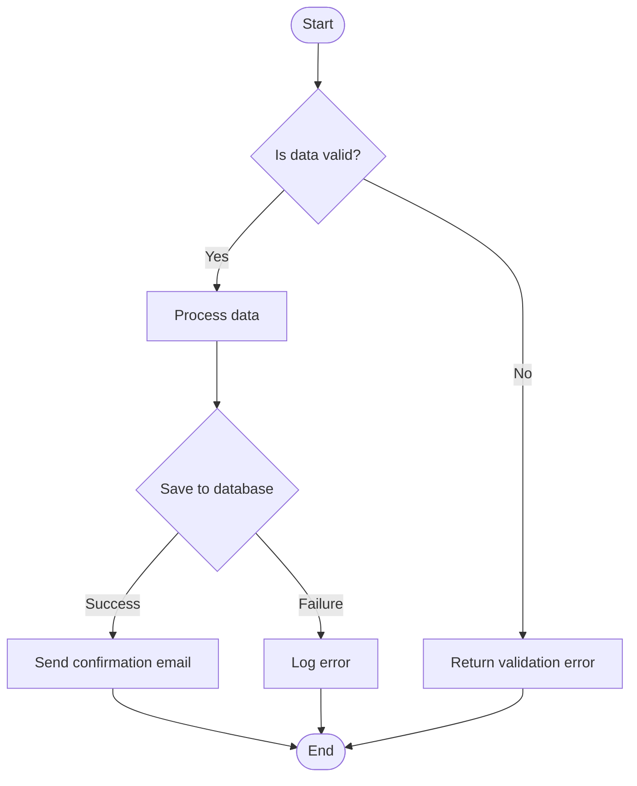
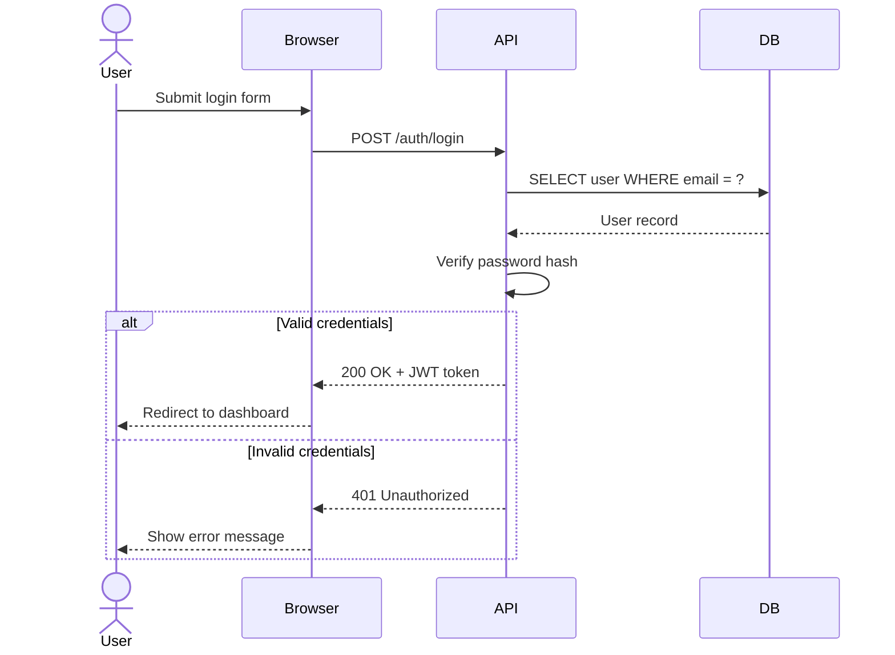
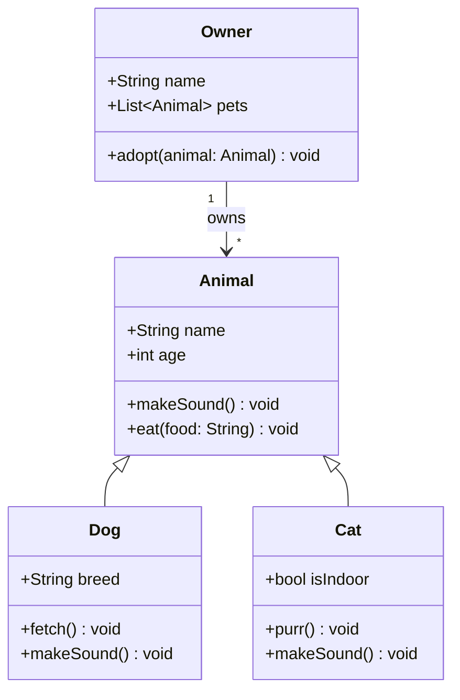
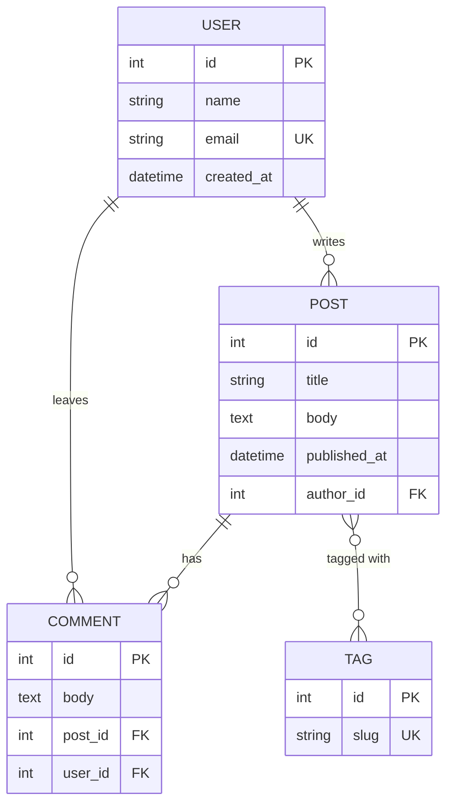
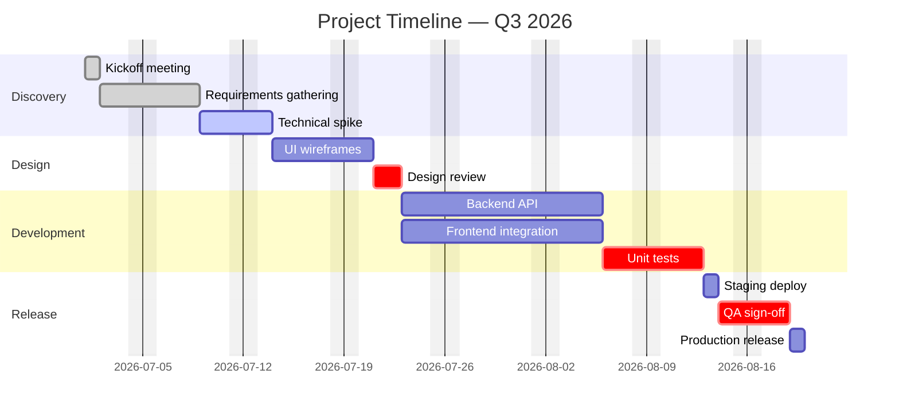
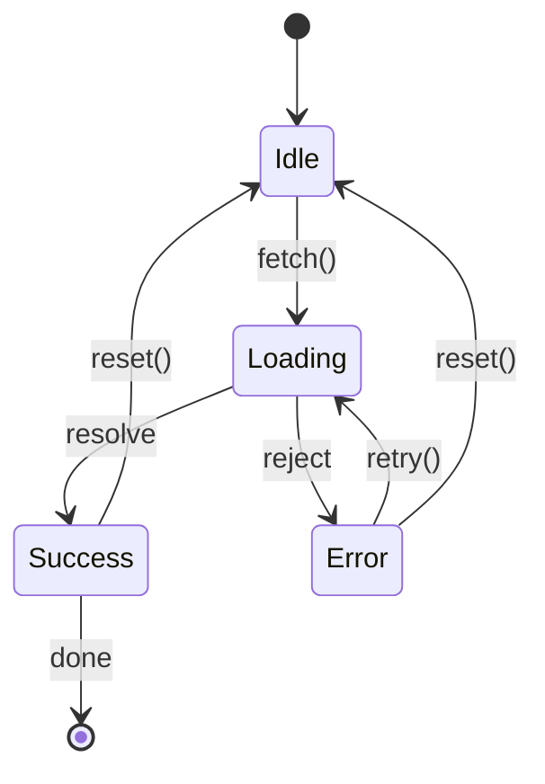
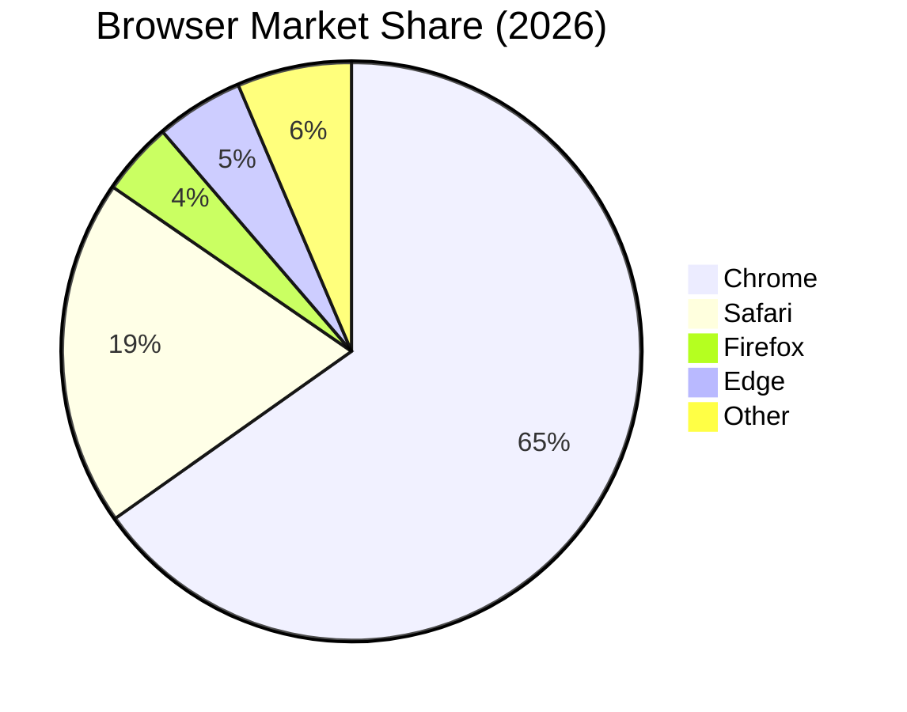
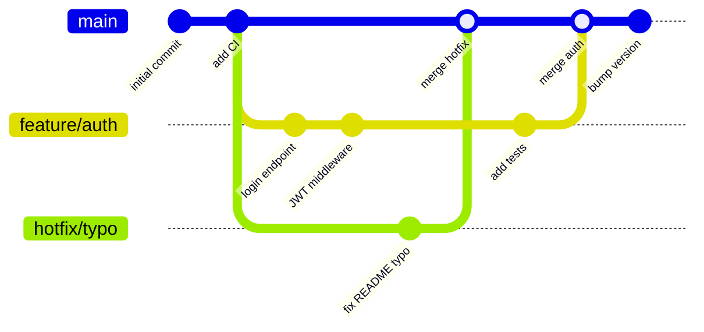
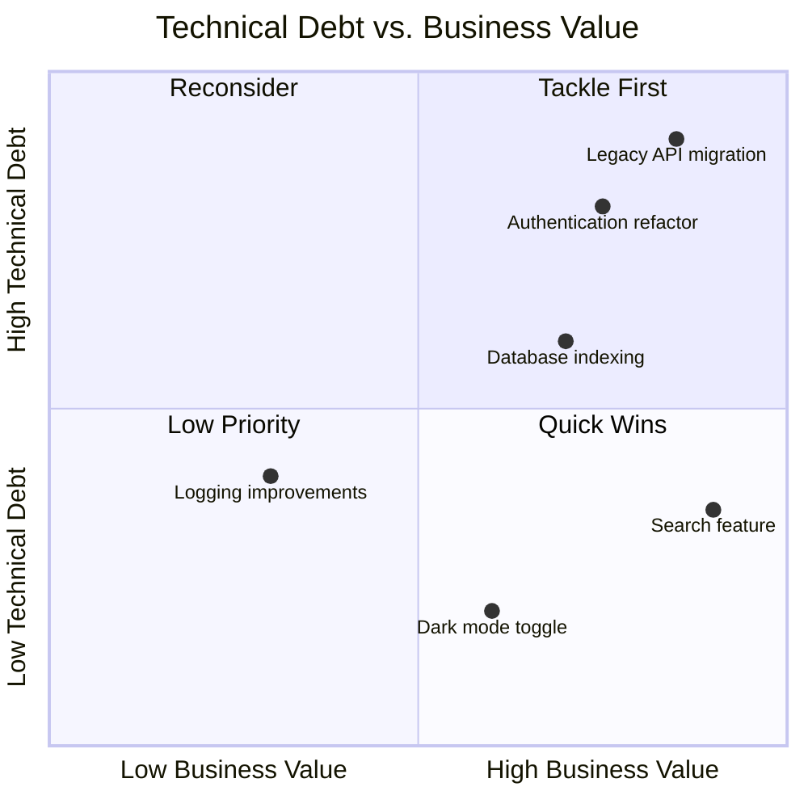
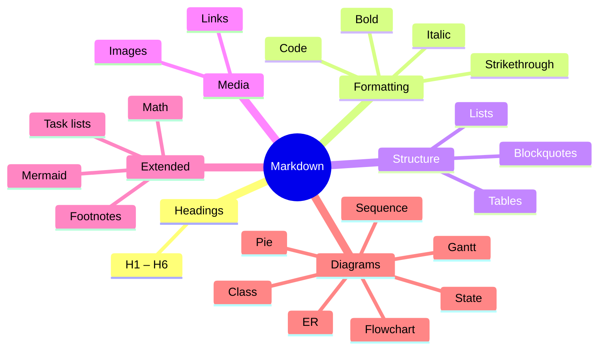

# Rich Markdown Example

> A comprehensive showcase of all standard Markdown elements, extended syntax, and Mermaid diagrams.

---

## Table of Contents

- [Headings](#headings)
- [Text Formatting](#text-formatting)
- [Blockquotes](#blockquotes)
- [Lists](#lists)
- [Code](#code)
- [Tables](#tables)
- [Links & Images](#links--images)
- [Horizontal Rules](#horizontal-rules)
- [Footnotes](#footnotes)
- [Task Lists](#task-lists)
- [Definition Lists](#definition-lists)
- [Math Equations](#math-equations)
- [Collapsible Sections](#collapsible-sections)
- [Mermaid Diagrams](#mermaid-diagrams)

---

## Headings

# Heading Level 1
## Heading Level 2
### Heading Level 3
#### Heading Level 4
##### Heading Level 5
###### Heading Level 6

---

## Text Formatting

Regular paragraph text. Lorem ipsum dolor sit amet, consectetur adipiscing elit.
Sed do eiusmod tempor incididunt ut labore et dolore magna aliqua.

**Bold text** and __also bold__.

*Italic text* and _also italic_.

***Bold and italic*** and ___also bold and italic___.

~~Strikethrough text~~

`Inline code`

<kbd>Ctrl</kbd> + <kbd>C</kbd>

<mark>Highlighted text</mark>

Superscript: X<sup>2</sup> + Y<sup>2</sup> = Z<sup>2</sup>

Subscript: H<sub>2</sub>O

---

## Blockquotes

> Single-level blockquote.

> Multi-line blockquote.
> This continues on the next line.

> Nested blockquote.
>
> > This is a nested quote inside the outer one.
> >
> > > And another level deeper.

> **Note:** Blockquotes can contain **formatting**, `code`, and other elements.

---

## Lists

### Unordered List

- Item one
- Item two
  - Nested item A
  - Nested item B
    - Deeply nested item
- Item three

### Ordered List

1. First item
2. Second item
   1. Sub-item 2.1
   2. Sub-item 2.2
3. Third item
4. Fourth item

### Mixed Nesting

1. Ordered first
   - Unordered nested under ordered
   - Another unordered item
2. Ordered second
   1. Ordered nested
      - Mixed level three

---

## Code

### Inline Code

Use `git commit -m "message"` to commit staged changes.

Call `console.log()` to print to the developer console.

### Fenced Code Blocks

```bash
# Shell script example
#!/usr/bin/env bash
set -euo pipefail

NAME="World"
echo "Hello, ${NAME}!"

for i in {1..5}; do
  echo "Iteration: $i"
done
```

```typescript
// TypeScript example
interface User {
  id: number;
  name: string;
  email: string;
  createdAt: Date;
}

async function fetchUser(id: number): Promise<User | null> {
  try {
    const response = await fetch(`/api/users/${id}`);
    if (!response.ok) return null;
    return response.json() as Promise<User>;
  } catch (error) {
    console.error("Failed to fetch user:", error);
    return null;
  }
}
```

```python
# Python example
from dataclasses import dataclass
from typing import Optional

@dataclass
class Node:
    value: int
    left: Optional["Node"] = None
    right: Optional["Node"] = None

def inorder(node: Optional[Node]) -> list[int]:
    if node is None:
        return []
    return inorder(node.left) + [node.value] + inorder(node.right)

root = Node(4, Node(2, Node(1), Node(3)), Node(6, Node(5), Node(7)))
print(inorder(root))  # [1, 2, 3, 4, 5, 6, 7]
```

```json
{
  "name": "markdown-example",
  "version": "1.0.0",
  "description": "A rich markdown showcase",
  "scripts": {
    "build": "tsc",
    "test": "jest"
  },
  "dependencies": {
    "remark": "^15.0.0"
  }
}
```

```sql
-- SQL example
SELECT
  u.id,
  u.name,
  COUNT(o.id)  AS order_count,
  SUM(o.total) AS total_spent
FROM users u
LEFT JOIN orders o ON o.user_id = u.id
WHERE u.created_at >= DATE_SUB(NOW(), INTERVAL 1 YEAR)
GROUP BY u.id, u.name
HAVING total_spent > 100
ORDER BY total_spent DESC
LIMIT 10;
```

---

## Tables

### Basic Table

| Name    | Type    | Required | Description                       |
| ------- | ------- | :------: | --------------------------------- |
| `id`    | number  |    ✓     | Unique identifier                 |
| `name`  | string  |    ✓     | Human-readable label              |
| `tags`  | array   |          | Optional list of category strings |
| `score` | float   |          | Relevance score between 0 and 1   |
| `meta`  | object  |          | Arbitrary key-value metadata      |

### Alignment Demo

| Left-aligned | Center-aligned | Right-aligned |
| :----------- | :------------: | ------------: |
| Alpha        |     Delta      |           700 |
| Beta         |    Epsilon     |         1 200 |
| Gamma        |      Zeta      |        98 765 |

---

## Links & Images

### Links

[External link](https://github.com)

[Link with title](https://github.com "Visit GitHub")

[Reference-style link][ref-label]

[ref-label]: https://example.com "Example Domain"

Auto-linked URL: <https://www.example.com>

Email link: <user@example.com>

### Images


#### Image as a Link

[](https://github.com)

---

## Horizontal Rules

Three ways to draw a horizontal rule:

---

***

___

---

## Footnotes

Here is a sentence with a footnote.[^1]

Extended footnotes support multi-paragraph notes.[^long-note]

[^1]: This is the first footnote definition.

[^long-note]: This footnote spans multiple paragraphs.

    Indent paragraphs to include them in the footnote body.

    You can include **formatting** and `code` inside footnotes.

---

## Task Lists

### Project Checklist

- [x] Set up repository
- [x] Write initial README
- [x] Add CI/CD pipeline
- [ ] Write unit tests
- [ ] Publish first release
- [ ] Set up documentation site

### Nested Tasks

- [x] Backend
  - [x] REST API endpoints
  - [x] Database schema
  - [ ] Rate limiting
- [ ] Frontend
  - [x] Login page
  - [ ] Dashboard view
  - [ ] Settings page

---

## Definition Lists

<dl>
  <dt>Markdown</dt>
  <dd>A lightweight markup language for creating formatted text using a plain-text editor.</dd>

  <dt>CommonMark</dt>
  <dd>A strongly specified, highly compatible implementation of Markdown.</dd>

  <dt>GFM</dt>
  <dd>GitHub Flavored Markdown — a superset of CommonMark with extensions like tables and task lists.</dd>
</dl>

---

## Math Equations

### Inline Math

The quadratic formula is $x = \dfrac{-b \pm \sqrt{b^2 - 4ac}}{2a}$.

Euler's identity: $e^{i\pi} + 1 = 0$

### Block Math

$$
\int_{-\infty}^{\infty} e^{-x^2}\, dx = \sqrt{\pi}
$$

$$
\nabla \times \mathbf{B} - \frac{1}{c}\frac{\partial \mathbf{E}}{\partial t} = \frac{4\pi}{c}\mathbf{J}
$$

$$
\sum_{n=1}^{\infty} \frac{1}{n^2} = \frac{\pi^2}{6}
$$

---

## Collapsible Sections

<details>
<summary>Click to expand — Installation Instructions</summary>

### Prerequisites

- Node.js >= 18
- npm >= 9

### Steps

```bash
git clone https://github.com/example/project.git
cd project
npm install
npm run build
```

You can nest **any** Markdown inside a `<details>` block, including code, tables, and lists.

</details>

<details>
<summary>Advanced Configuration</summary>

| Option       | Default | Description                         |
| ------------ | ------- | ----------------------------------- |
| `port`       | `3000`  | HTTP server port                    |
| `logLevel`   | `info`  | One of `debug`, `info`, `warn`, `error` |
| `maxRetries` | `3`     | Maximum number of retry attempts    |

</details>

---

## Mermaid Diagrams

### Flowchart



### Sequence Diagram



### Class Diagram



### Entity Relationship Diagram



### Gantt Chart



### State Diagram



### Pie Chart



### Git Graph



### Quadrant Chart



### Mind Map



---

## HTML Embeds

Raw HTML can extend Markdown when needed.

<div align="center">

| Badge | Status |
|-------|--------|
| Build |  |
| License |  |
| Version |  |

</div>

---

## Emoji

GitHub-flavored Markdown supports emoji shortcodes:

:rocket: Launch · :bug: Bug · :sparkles: Feature · :hammer: Fix · :books: Docs · :white_check_mark: Done · :warning: Warning · :fire: Hot · :lock: Security · :recycle: Refactor

---

*End of example — all standard and extended Markdown elements demonstrated above.*
